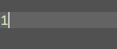

## Paredit plugin

Paredit (Structural Editing) is a fancy editing style to edit code especially for s-expression, the origin purpose of this plugin is to give a universial paredit support for all programming language when using IntelliJ IDEA-based IDEs, but every language support in Jetbrains systems holds its own AST structure and it's really complicated to support all, so it's just support s-expression for now, luckily you can use splice action in some special condition but it's not always work.

## Snapshot

## ShortCuts

* Barf Backwards  ⌥⌘9
* Barf Forwards   ⌥⌘0
* Slurp Backwards ⌥⇧⌘9
* Slurp Forwards  ⌥⇧⌘0
* Splice          ⌃⌥S

## License

Copyright © 2016 zjhmale

Released under the terms of the MIT License
